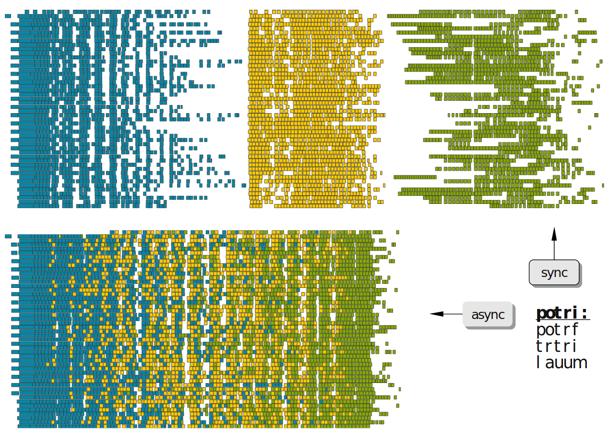

*** Using Chameleon executables
:PROPERTIES:
:CUSTOM_ID: doc-using-executables
:END:
    <<sec:usetesting>>

    Chameleon provides several test executables that are compiled and
    linked with Chameleon's dependencies.  Instructions about the
    arguments to give to executables are accessible thanks to the
    option ~-[-]help~ or ~-[-]h~.  This set of binaries are separated into
    three categories and can be found in three different directories:
    * *example*: contains examples of API usage and more specifically the
      sub-directory ~lapack_to_chameleon/~ provides a tutorial that explains
      how to use Chameleon functionalities starting from a full LAPACK
      code, see [[sec:tuto][Tutorial LAPACK to Chameleon]]
    * *testing*: contains testing drivers to check numerical
      correctness and assess performance of Chameleon linear algebra
      routines with a wide range of parameters
      #+begin_src
      ./testing/chameleon_stesting -H -o gemm -t 2 -m 2000 -n 2000 -k 2000
      #+end_src

      To get the list of parameters, use the ~-h~ or ~--help~ option.
      #+begin_src
      ./testing/chameleon_stesting -h
      #+end_src

      Available algorithms for testing are:
      * cesca     General centered-scaled matrix transformation
      * geadd     General matrix-matrix addition
      * gelqf     General LQ factorization
      * gelqf_hqr General LQ factorization with hierachical reduction trees
      * gels_hqr  Linear least squares with general matrix using hierarchical reduction trees
      * gels      Linear least squares with general matrix
      * gemm_batch Perform nb*ib general matrix-matrix multiply of size MxNxK
      * gemm      General matrix-matrix multiply
      * genm2     General matrix two-norm estimator
      * gepdf_qdwh Polar decomposition factorization with QDWH algorithm
      * gepdf_qr  Polar decomposition factorization with QDWH algorithm
      * geqrf     General QR factorization
      * geqrf_hqr General QR factorization with hierachical reduction trees
      * gesvd     Singular Value Decomposition
      * gesv      General linear system solve (LU with partial pivoting)
      * gesv_nopiv General linear system solve (LU without pivoting)
      * getrf     General LU factorization (with partial pivoting)
      * getrf_nopiv General factorization (LU without pivoting)
      * getrs     General triangular solve (LU with partial pivoting)
      * getrs_nopiv General triangular solve (LU without pivoting)
      * gram      General Gram matrix transformation
      * lacpy     General matrix copy
      * lange     General matrix norm
      * lansy     Symmetric matrix norm
      * lantr     Triangular matrix norm
      * lascal    General matrix scaling
      * laswp     Row interchange on general matrices
      * lauum     Triangular in-place matrix-matrix computation for Cholesky inversion
      * orglq_hqr Q generation with hierarchical reduction trees (LQ)
      * orglq     Q generation (LQ)
      * orgqr_hqr Q generation with hierarchical reduction trees (QR)
      * orgqr     Q generation (QR)
      * ormlq_hqr Q application with hierarchical reduction trees (LQ)
      * ormlq     Q application (LQ)
      * ormqr_hqr Q application with hierarchical reduction trees (QR)
      * ormqr     Q application (QR)
      * plrnk     General rank-k matrix generation
      * poinv     Symmetric positive definite matrix inversion
      * posv      Symmetric positive definite linear system solve (Cholesky)
      * potrf_batch Perform nb*ib Cholesky factorization potrf( uplo, N, ... )
      * potrf     Symmetric positive definite factorization (Cholesky)
      * potri     Symmetric positive definite matrix inversion
      * potrs     Symmetric positive definite solve (Cholesky)
      * print     Print descriptors
      * symm      Symmetric matrix-matrix multiply
      * syr2k     Symmetrix matrix-matrix rank 2k update
      * syrk_batch Perform nb*ib rank-k updates ssyrk( uplo, trans, N, K, ... )
      * syrk      Symmetrix matrix-matrix rank k update
      * tradd     Triangular matrix-matrix addition
      * trmm      Triangular matrix-matrix multiply
      * trsm_batch Perform nb*ib triangular solve trsm( side, uplo, trns, diag, M, N, ... )
      * trsm      Triangular matrix solve
      * trtri     Triangular matrix inversion

**** Configuration through environment variables
     <<sec:env_variables>>

     Some parameters of the Chameleon library can be set to some
     default values through environment variables which are listed
     below.  Note that the code itself can modify these values through
     calls to `CHAMELEON_Enable()`, `CHAMELEON_Disable()`, or
     `CHAMELEON_Set()` (see [[sec:options_routines][Options]])

     * *CHAMELEON_TILE_SIZE* defines the default tile size value for
       all algorithms. The default value is *384*.
     * *CHAMELEON_INNER_BLOCK_SIZE* defines the default inner blocking
       size value for algorithms that requires it (mainly QR/LQ
       algorithms). The default value is *48*.
     * *CHAMELEON_HOUSEHOLDER_MODE* changes the basic QR algorithm
       from a flat tree (*1*, *ChamFlatHouseholder* or *Flat*) to an
       Householder tree (*2*, *ChamTreeHouseholder*, or *Tree* ). The
       default value is *ChamFlatTree*.
     * *CHAMELEON_HOUSEHOLDER_SIZE* defines the size of the local
       housholder trees if the Houselmoder tree mode is set. The
       default value is *4*.
     * *CHAMELEON_TRANSLATION_MODE* defines the translation used in
       the LAPACK API routines. *1*, *In*, or *ChamInPlace* sets the
       in-place translation to avoid copies. *2*, *Out*,
       *ChamOutOfPlace* sets the out-of-place translation that uses a
       copy of the matrix. The default is *ChamInPlace*.
     * *CHAMELEON_GENERIC*, if ON all algorithms using specialized
       algorithms specific to data distributions are disabled.
     * *CHAMELEON_AUTOMINMAX*, if ON the minimal/maximal limits of
       tasks that can be submitted to the runtime system are
       set. These limits are computed per algorithm using the
       _lookahead_ parameter. (StarPU specific, and currently
       only available for getrf)
     * *CHAMELEON_LOOKAHEAD* defines the number of steps that will be
       submitted in advance in algorithms using lookahead
       techniques. The default is *1*.

     * *CHAMELEON_WARNINGS* enables/disables the warning output
     * *CHAMELEON_PARALLEL_KERNEL* enables/disables the use of
       multi-threaded kernels. Available only for StarPU runtime system.
     * *CHAMELEON_GENERATE_STATS* enables the profiling information of
       the kernels (StarPU specific)
     * *CHAMELEON_PROGRESS* enables the progress function to show the
       percentage of tasks completed.
     * *CHAMELEON_BATCH_SIZE* to change batch size (group some data to call one
       single task on it)
     * *CHAMELEON_GETRF_BATCH_SIZE* batch size for the specific case of getrf
     * *CHAMELEON_GEMM_ALGO* give the possibility to switch among multiple
       variants of the GEMM algorithms. These variants are *GENERIC* for the
       generic variant that should work with any configuration; *SUMMA_C* that
       works for 2D block cyclic distribution of the matrices A, B, and C with
       a C stationnary version; *SUMMA_A* and *SUMMA_B* are SUMMA variant of the
       algorithm that works for any distribution with respectively *A*, or *B* that
       are stationnary. Note that the last two variants are only available with
       the StarPU runtime backend.

**** Execution trace using EZTrace
     <<sec:trace_ezt>>

     [[https://eztrace.gitlab.io/eztrace/][EZTrace]] can be used by chameleon to generate traces. Two modules
     are automatically generated as soon as EZTrace is detected on the
     system. The first one (which is recommended) is the
     ~chameleon_tcore~ module. It traces all the ~TCORE_...()~ functions
     that are called by the codelets of all the runtime but PaRSEC. The
     second one is the ~chameleon_core~ module which traces the lower
     level ~CORE_...()~ functions. If using PaRSEC, you need to use this
     module to generate the traces.

     To generate traces with EZTrace, you need first to compile with
     *-DBUILD_SHARED_LIBS=ON*. EZTrace is using weak symbols to overload
     function calls with ld_preload and enable trace generation. Then,
     either you install the ~libeztrace-*.so~ files into the EZTrace
     install directory, or you can add the path of the modules to your
     environement
     #+begin_src
     export EZTRACE_LIBRARY_PATH=/path/to/your/modules
     #+end_src

     To check if the modules are available you should have
     #+begin_src
     $ eztrace_avail
     1	omp	Module for OpenMP parallel regions
     2	pthread	Module for PThread synchronization functions (mutex, semaphore, spinlock, etc.)
     3	stdio	Module for stdio functions (read, write, select, poll, etc.)
     4	mpi	Module for MPI functions
     5	memory	Module for memory functions (malloc, free, etc.)
     6	papi	Module for PAPI Performance counters
     128	chameleon_core	Module for Chameleon CORE functions
     129	chameleon_tcore	Module for Chameleon TCORE functions
     #+end_src

     Then, you can restrict the modules used during the execution
     #+begin_src
     export EZTRACE_TRACE="mpi chameleon_tcore"
     #+end_src

     _The module ~mpi~ is required if you want to run in distributed._

     The setup can be checked with ~eztrace_loaded~
     #+begin_src
     $ eztrace_loaded
     4	mpi	Module for MPI functions
     129	chameleon_tcore	Module for Chameleon TCORE functions
     #+end_src

     To generate the traces, you need to run your binary through
     eztrace:
     #+begin_src
     eztrace ./chameleon_dtesting -o gemm -n 1000 -b 200
     mpirun -np 4 eztrace ./chameleon_dtesting -o gemm -n 1000 -b 200 -P 2
     #+end_src

     Convert the binary files into a ~.trace~ file, and visualize it.
     #+begin_src
     eztrace_convert <username>_eztrace_log_rank_<[0-9]*>
     vite eztrace_output.trace
     #+end_src

     For more information on EZTrace, you can follow the [[https://eztrace.gitlab.io/eztrace/][support page]].

**** Execution trace using StarPU/FxT
     <<sec:trace_fxt>>

     StarPU can generate its own trace log files by compiling it with
     the ~--with-fxt~ option at the configure step (you can have to
     specify the directory where you installed FxT by giving
     ~--with-fxt=...~ instead of ~--with-fxt~ alone). In addition, the
     environment variable STARPU_FXT_TRACE must be set to 1.
     #+begin_example
     export STARPU_FXT_TRACE=1
     #+end_example
     And passing the ~-T~ option to the ~chameleon_xtesting~ program.
     By doing so, traces are generated after each execution of a program which
     uses StarPU in the directory pointed by the
     [[https://files.inria.fr/starpu/doc/html/ExecutionConfigurationThroughEnvironmentVariables.html][STARPU_FXT_PREFIX]]
     environment variable (if not set the default path is /tmp/).
     #+begin_example
     export STARPU_FXT_PREFIX=/home/jdoe/fxt_files/
     #+end_example
     When executing a ~./testing/...~ Chameleon program, if it has been
     enabled (StarPU compiled with FxT), the program will generate
     trace files in the directory $STARPU_FXT_PREFIX.

     To save only some specific types of events the variable [[https://files.inria.fr/starpu/doc/html/ExecutionConfigurationThroughEnvironmentVariables.html][STARPU_FXT_EVENTS]].

     Finally, to generate the trace file which can be opened with [[https://gitlab.inria.fr/solverstack/vite][Vite]]
     program, you can use the *starpu_fxt_tool* executable of StarPU.
     This tool should be in the bin directory of StarPU's installation.
     You can use it to generate the trace file like this:
     #+begin_src
     path/to/your/install/starpu/bin/starpu_fxt_tool -i prof_filename
     #+end_src
     There is one file per mpi processus (prof_filename_0,
     prof_filename_1 ...).  To generate a trace of mpi programs you can
     call it like this:
     #+begin_src
     path/to/your/install/starpu/bin/starpu_fxt_tool -i prof_filename*
     #+end_src
     The trace file will be named paje.trace (use -o option to specify
     an output name).  Alternatively, for non mpi execution (only one
     processus and profiling file), you can set the environment
     variable *STARPU_GENERATE_TRACE=1* to automatically generate the
     paje trace file.

**** Use simulation mode with StarPU-SimGrid
     <<sec:simu>>

     Simulation mode can be activated by setting the cmake option
     CHAMELEON_SIMULATION to ON.  This mode allows you to simulate
     execution of algorithms with StarPU compiled with
     [[https://github.com/simgrid/simgrid][SimGrid]].
     To do so, we provide some perfmodels in the simucore/perfmodels/
     directory of Chameleon sources.  To use these perfmodels, please
     set your *STARPU_HOME* environment variable to
     ~path/to/your/chameleon_sources/simucore/perfmodels~.  Finally, you
     need to set your *STARPU_HOSTNAME* environment variable to the name
     of the machine to simulate.

     The algorithms available for now: gemm, symm, potrf, potrs, potri, posv,
     getrf_nopiv, getrs_nopiv, geqrf, geqrf_hqr, gels, gels_hqr, simple and
     double precisions on
     [[https://plafrim-users.gitlabpages.inria.fr/doc/][PlaFRIM nodes with GPUs]].
     The tile size to use depending on the platform /i.e./ *STARPU_HOSTNAME*
     (choose a size *N* multiple of the tile size):
     - /sirocco-k40m/: 960
     - /sirocco-p100/: 1240
     - /sirocco-v100/: 1600
     - /sirocco-a100/: 1600
     - /sirocco-rtx8000/: 1600
     In addition the *potrf* algorithm is also available on /mirage/ and
     /sirocco/ machines for the following tile sizes
     - /mirage/: 320, 960
     - /sirocco/: 80, 440, 960, 1440, 1920

     Database of models is subject to change.

     #+begin_example
     export STARPU_HOME=/tmp/chameleon/simucore/perfmodels/
     export STARPU_HOSTNAME=sirocco
     ./testing/chameleon_dtesting -o potrf -t 22 -g 2 -n 14400 -b 1440 --nowarmup
     0;dpotrf;22;2;1;1;0;1440;121;14400;14400;1804289383;0.000000e+00;7.867404e-01;1.265261e+03

     export STARPU_HOSTNAME=sirocco-k40m
     ./testing/chameleon_stesting -o gemm -t 38 -g 2 -n 64000 -b 1600 --nowarmup
     0;sgemm;38;2;1;1;0;1600;111;111;64000;64000;64000;64000;64000;64000;4.892778e-01;-1.846424e-01;1649760492;596516649;1189641421;0.000000e+00;2.010660e+01;2.607541e+04

     export STARPU_HOSTNAME=sirocco-p100
     ./testing/chameleon_dtesting -o geqrf -g 2 -t 30 -b 1240 -n 39680 --nowarmup
     0;dgeqrf;30;2;1;1;0;1240;48;39680;39680;39680;4;1804289383;0.000000e+00;3.893336e+01;2.139677e+03
     #+end_example

**** Use out of core support with StarPU
     <<sec:ooc>>

     If the matrix can not fit in the main memory, StarPU can automatically evict
     tiles to the disk. The following variables need to be set:
     * *STARPU_DISK_SWAP* environment variable to a place where to store
     evicted tiles, for example: ~STARPU_DISK_SWAP=/tmp~
     * *STARPU_DISK_SWAP_BACKEND* environment variable to the I/O method,
     for example: ~STARPU_DISK_SWAP_BACKEND=unistd_o_direct~
     * *STARPU_LIMIT_CPU_MEM* environment variable to the amount of memory
     that can be used in MBytes, for example: ~STARPU_LIMIT_CPU_MEM=1000~
*** Tutorial LAPACK to Chameleon
:PROPERTIES:
:CUSTOM_ID: doc-using-tuto-lapack-to-chameleon
:END:
    <<sec:tuto>>

    Chameleon provides routines to solve dense general systems of
    linear equations, symmetric positive definite systems of linear
    equations and linear least squares problems, using LU, Cholesky, QR
    and LQ factorizations.  Real arithmetic and complex arithmetic are
    supported in both single precision and double precision.  Routines
    that compute linear algebra are of the following form:
    #+begin_src
    CHAMELEON_name[_Tile[_Async]]
    #+end_src
    * all user routines are prefixed with *CHAMELEON*
    * in the pattern *CHAMELEON_name[_Tile[_Async]]*, /name/ follows the
      BLAS/LAPACK naming scheme for algorithms (/e.g./ sgemm for general
      matrix-matrix multiply simple precision)
    * Chameleon provides three interface levels
      * *CHAMELEON_name*: simplest interface, very close to CBLAS and
        LAPACKE, matrices are given following the LAPACK data layout
        (1-D array column-major).  It involves copy of data from LAPACK
        layout to tile layout and conversely (to update LAPACK data),
        see [[sec:tuto_step1][Step1]].
      * *CHAMELEON_name_Tile*: the tile interface avoid copies between LAPACK
        and tile layouts. It is the standard interface of Chameleon and
        it should achieved better performance than the previous
        simplest interface. The data are given through a specific
        structure called a descriptor, see [[sec:tuto_step2][Step2]].
      * *CHAMELEON_name_Tile_Async*: similar to the tile interface, it avoids
        synchonization barrier normally called between *Tile* routines.
        At the end of an *Async* function, completion of tasks is not
        guaranteed and data are not necessarily up-to-date.  To ensure
        that tasks have been all executed, a synchronization function
        has to be called after the sequence of *Async* functions, see
        [[sec:tuto_step4][Step4]].

    CHAMELEON routine calls have to be preceded from
    #+begin_src
    CHAMELEON_Init( NCPU, NGPU );
    #+end_src
    to initialize CHAMELEON and the runtime system and followed by
    #+begin_src
    CHAMELEON_Finalize();
    #+end_src
    to free some data and finalize the runtime and/or MPI.

    This tutorial is dedicated to the API usage of Chameleon.  The
    idea is to start from a simple code and step by step explain how
    to use Chameleon routines.  The first step is a full BLAS/LAPACK
    code without dependencies to Chameleon, a code that most users
    should easily understand.  Then, the different interfaces
    Chameleon provides are exposed, from the simplest API (step1) to
    more complicated ones (until step4).  The way some important
    parameters are set is discussed in step5.  step6 is an example
    about distributed computation with MPI.  Finally step7 shows how
    to let Chameleon initialize user's data (matrices/vectors) in
    parallel.

    Source files can be found in the ~example/lapack_to_chameleon/~
    directory.  If CMake option *CHAMELEON_ENABLE_EXAMPLE* is ON then
    source files are compiled with the project libraries.  The
    arithmetic precision is /double/.  To execute a step
    *X*, enter the following command:
    #+begin_src
    ./stepX --option1 --option2 ...
    #+end_src
    Instructions about the arguments to give to executables are
    accessible thanks to the option ~-[-]help~ or ~-[-]h~.  Note there
    exist default values for options.

    For all steps, the program solves a linear system $Ax=B$ The
    matrix values are randomly generated but ensure that matrix $A$ is
    symmetric positive definite so that $A$ can be factorized in a
    $LL^T$ form using the Cholesky factorization.

    The different steps of the tutorial are:
    * Step0: a simple Cholesky example using the C interface of BLAS/LAPACK
    * Step1: introduces the LAPACK equivalent interface of Chameleon
    * Step2: introduces the tile interface
    * Step3: indicates how to give your own tile matrix to Chameleon
    * Step4: introduces the tile async interface
    * Step5: shows how to set some important parameters
    * Step6: introduces how to benefit from MPI in Chameleon
    * Step7: introduces how to let Chameleon initialize the user's matrix data

**** Step0
     The C interface of BLAS and LAPACK, that is, CBLAS and LAPACKE,
     are used to solve the system. The size of the system (matrix) and
     the number of right hand-sides can be given as arguments to the
     executable (be careful not to give huge numbers if you do not
     have an infinite amount of RAM!).  As for every step, the
     correctness of the solution is checked by calculating the norm
     $||Ax-B||/(||A||||x||+||B||)$.  The time spent in
     factorization+solve is recorded and, because we know exactly the
     number of operations of these algorithms, we deduce the number of
     operations that have been processed per second (in GFlops/s).
     The important part of the code that solves the problem is:
     #+begin_example
     /* Cholesky factorization:
      * A is replaced by its factorization L or L^T depending on uplo */
     LAPACKE_dpotrf( LAPACK_COL_MAJOR, 'U', N, A, N );
     /* Solve:
      * B is stored in X on entry, X contains the result on exit.
      * Forward ...
      */
     cblas_dtrsm(
         CblasColMajor,
         CblasLeft,
         CblasUpper,
         CblasConjTrans,
         CblasNonUnit,
         N, NRHS, 1.0, A, N, X, N);
     /* ... and back substitution */
     cblas_dtrsm(
         CblasColMajor,
         CblasLeft,
         CblasUpper,
         CblasNoTrans,
         CblasNonUnit,
         N, NRHS, 1.0, A, N, X, N);
     #+end_example

**** Step1
     <<sec:tuto_step1>>

     It introduces the simplest Chameleon interface which is
     equivalent to CBLAS/LAPACKE.  The code is very similar to step0
     but instead of calling CBLAS/LAPACKE functions, we call Chameleon
     equivalent functions.  The solving code becomes:
     #+begin_example
     /* Factorization: */
     CHAMELEON_dpotrf( UPLO, N, A, N );
     /* Solve: */
     CHAMELEON_dpotrs(UPLO, N, NRHS, A, N, X, N);
     #+end_example
     The API is almost the same so that it is easy to use for beginners.
     It is important to keep in mind that before any call to CHAMELEON routines,
     *CHAMELEON_Init* has to be invoked to initialize CHAMELEON and the runtime system.
     Example:
     #+begin_example
     CHAMELEON_Init( NCPU, NGPU );
     #+end_example
     After all CHAMELEON calls have been done, a call to *CHAMELEON_Finalize* is
     required to free some data and finalize the runtime and/or MPI.
     #+begin_example
     CHAMELEON_Finalize();
     #+end_example
     We use CHAMELEON routines with the LAPACK interface which means the
     routines accepts the same matrix format as LAPACK (1-D array
     column-major).  Note that we copy the matrix to get it in our own
     tile structures, see details about this format here [[sec:tile][Tile Data
     Layout]].  This means you can get an overhead coming from copies.

**** Step2
     <<sec:tuto_step2>>

     This program is a copy of step1 but instead of using the LAPACK interface which
     reads to copy LAPACK matrices inside CHAMELEON routines we use the tile interface.
     We will still use standard format of matrix but we will see how to give this
     matrix to create a CHAMELEON descriptor, a structure wrapping data on which we want
     to apply sequential task-based algorithms.
     The solving code becomes:
     #+begin_example
     /* Factorization: */
     CHAMELEON_dpotrf_Tile( UPLO, descA );
     /* Solve: */
     CHAMELEON_dpotrs_Tile( UPLO, descA, descX );
     #+end_example
     To use the tile interface, a specific structure *CHAM_desc_t* must be
     created.
     This can be achieved from different ways.
     1. Use the existing function *CHAMELEON_Desc_Create*: means the matrix
        data are considered contiguous in memory as it is considered
        in PLASMA ([[sec:tile][Tile Data Layout]]).
     2. Use the existing function *CHAMELEON_Desc_Create_OOC*: means the
        matrix data is allocated on-demand in memory tile by tile, and
        possibly pushed to disk if that does not fit memory.
     3. Use the existing function *CHAMELEON_Desc_Create_User*: it is more
        flexible than *Desc_Create* because you can give your own way to
        access to tile data so that your tiles can be allocated
        wherever you want in memory, see next paragraph [[sec:tuto_step3][Step3]].
     4. Create you own function to fill the descriptor.  If you
        understand well the meaning of each item of *CHAM_desc_t*, you
        should be able to fill correctly the structure.

     In Step2, we use the first way to create the descriptor:
     #+begin_example
     CHAMELEON_Desc_Create(&descA, A, ChamRealDouble,
                       NB, NB, NB*NB, N, N,
                       0, 0, N, N,
                       1, 1);
     #+end_example
     * *descA* is the descriptor to create.
     * The second argument is a pointer to existing data. The existing
       data must follow LAPACK Column major layout [[sec:tile][Tile Data Layout]]
       (1-D array column-major)  if *CHAMELEON_Desc_Create* is used to create
       the descriptor. The *CHAMELEON_Desc_Create_User* function can be used
       if you have data organized differently. This is discussed in
       the next paragraph [[sec:tuto_step3][Step3]].  Giving a *NULL* pointer means you let
       the function allocate memory space.  This requires to copy the
       original data into the memory managed by the descriptor by
       calling:
       #+begin_example
       CHAMELEON_Lap2Desc( ChamUpperLower, A, N, descA );
       #+end_example
     * The third argument of @code{Desc_Create} is the datatype (used for
       memory allocation).
     * Fourth to eight arguments stand for respectively,
       the number of rows (*NB*), columns (*NB*) in each tile, the total
       number of values in a tile (*NB*NB*), the number of rows (*N*),
       and colmumns (*N*) in the entire matrix stored in the
       memory area.
     * The ninth (@code{i}) and tenth (@code{j}) arguments are
       deprecated and should be set to 0. Their are kept for API
       backward compatibility.stand for respectively,
     * The eleventh (@code{m}) and twelfth (@code{n}) gives the size
       of the matrix used in the later algorithms.  These
       arguments are specific and used in precise cases.  If you do
       not consider submatrices, just use the same values as for the
       entire matrix size.
     * The last two arguments are the parameters of the 2-D block-cyclic
       distribution grid, see [[http://www.netlib.org/scalapack/slug/node75.html][ScaLAPACK]].  To be able to use other data
       distribution over the nodes, *CHAMELEON_Desc_Create_User* function
       should be used. These should be both set to *1* if you provide
       the data pointer.

**** Step3
     <<sec:tuto_step3>>

     This program makes use of the same interface than Step2 (tile
     interface) but does not allocate LAPACK matrices anymore so that
     no copy between LAPACK matrix layout and tile matrix layout are
     necessary to call CHAMELEON routines.  To generate random right
     hand-sides you can use:
     #+begin_example
     /* Allocate memory and initialize descriptor B */
     CHAMELEON_Desc_Create(&descB,  NULL, ChamRealDouble,
                       NB, NB,  NB*NB, N, NRHS,
                       0, 0, N, NRHS, 1, 1);
     /* generate RHS with random values */
     CHAMELEON_dplrnt_Tile( descB, 5673 );
     #+end_example
     The other important point is that is it possible to create a
     descriptor, the necessary structure to call CHAMELEON efficiently, by
     giving your own pointer to tiles if your matrix is not organized
     as a 1-D array column-major.  This can be achieved with the
     *CHAMELEON_Desc_Create_User* routine.  Here is an example:
     #+begin_example
     CHAMELEON_Desc_Create_User(&descA, matA, ChamRealDouble,
                            NB, NB, NB*NB, N, N,
                            0, 0, N, N, 1, 1,
                            user_getaddr_arrayofpointers,
                            user_getblkldd_arrayofpointers,
                            user_getrankof_zero, NULL);
     #+end_example
     Firsts arguments are the same than *CHAMELEON_Desc_Create* routine.
     Following arguments allows you to give pointer to functions that
     manage the access to tiles from the structure given as second
     argument.  Here for example, *matA* is an array containing
     addresses to tiles, see the function *allocate_tile_matrix*
     defined in step3.h. If you want the matrix to be allocate by
     Chameleon, you can use the *CHAMELEON_MAT_ALLOC_GLOBAL*, or the
     *CHAMELEON_MAT_ALLOC_TILE* variables to allocate repectively as a
     single large allocation, or to allocate tile by tile as late as
     possible. The three functions you have to
     define for *Desc_Create_User* are:
     * a function that returns address of tile $A(m,n)$, m and n
       standing for the indexes of the tile in the global matrix. Lets
       consider a matrix @math{4x4} with tile size 2x2, the matrix
       contains four tiles of indexes: $A(m=0,n=0)$, $A(m=0,n=1)$,
       $A(m=1,n=0)$, $A(m=1,n=1)$
     * a function that returns the leading dimension of tile $A(m,*)$
     * a function that returns MPI rank of tile $A(m,n)$
     * a pointer to a structure that these three functions can use to store
       additional data.

     Examples for these functions are visible in step3.h.  Note that
     the way we define these functions is related to the tile matrix
     format and to the data distribution considered.  This example
     should not be used with MPI since all tiles are affected to
     processus 0, which means a large amount of data will be
     potentially transfered between nodes.

**** Step4
     <<sec:tuto_step4>>

     This program is a copy of step2 but instead of using the tile
     interface, it uses the tile async interface.  The goal is to
     exhibit the runtime synchronization barriers.  Keep in mind that
     when the tile interface is called, like *CHAMELEON_dpotrf_Tile*,
     a synchronization function, waiting for the actual execution and
     termination of all tasks, is called to ensure the proper
     completion of the algorithm (i.e. data are up-to-date).  The code
     shows how to exploit the async interface to pipeline subsequent
     algorithms so that less synchronisations are done.  The code
     becomes:
     #+begin_example
     /* Cham structure containing parameters and a structure to interact with
      * the Runtime system */
     CHAM_context_t *chamctxt;
     /* CHAMELEON sequence uniquely identifies a set of asynchronous function calls
      * sharing common exception handling */
     RUNTIME_sequence_t *sequence = NULL;
     /* CHAMELEON request uniquely identifies each asynchronous function call */
     RUNTIME_request_t request = CHAMELEON_REQUEST_INITIALIZER;
     int status;

     ...

     chameleon_sequence_create(chamctxt, &sequence);

     /* Factorization: */
     CHAMELEON_dpotrf_Tile_Async( UPLO, descA, sequence, &request );

     /* Solve: */
     CHAMELEON_dpotrs_Tile_Async( UPLO, descA, descX, sequence, &request);

     /* Synchronization barrier (the runtime ensures that all submitted tasks
      * have been terminated */
     RUNTIME_barrier(chamctxt);
     /* Ensure that all data processed on the gpus we are depending on are back
      * in main memory */
     RUNTIME_desc_getoncpu(descA);
     RUNTIME_desc_getoncpu(descX);

     status = sequence->status;
     #+end_example

     Here the sequence of *dpotrf* and *dpotrs* algorithms is processed
     without synchronization so that some tasks of *dpotrf* and *dpotrs*
     can be concurently executed which could increase performances.
     The async interface is very similar to the tile one.  It is only
     necessary to give two new objects *RUNTIME_sequence_t* and
     *RUNTIME_request_t* used to handle asynchronous function calls.

     #+CAPTION: POTRI (POTRF, TRTRI, LAUUM) algorithm with and without synchronization barriers, courtesey of the [[http://icl.cs.utk.edu/plasma/][PLASMA]] team.
     #+NAME: fig:potri_async
     #+ATTR_HTML: :width 640px :align center
     

**** Step5
     <<sec:tuto_step5>>

     Step5 shows how to set some important parameters.  This program
     is a copy of Step4 but some additional parameters are given by
     the user.  The parameters that can be set are:
     * number of Threads
     * number of GPUs

       The number of workers can be given as argument
       to the executable with ~--threads=~ and ~--gpus=~ options.  It is
       important to notice that we assign one thread per gpu to
       optimize data transfer between main memory and devices memory.
       The number of workers of each type CPU and CUDA
       must be given at *CHAMELEON_Init*.
       #+begin_example
       if ( iparam[IPARAM_THRDNBR] == -1 ) {
           get_thread_count( &(iparam[IPARAM_THRDNBR]) );
           /* reserve one thread par cuda device to optimize memory transfers */
           iparam[IPARAM_THRDNBR] -=iparam[IPARAM_NCUDAS];
       }
       NCPU = iparam[IPARAM_THRDNBR];
       NGPU = iparam[IPARAM_NCUDAS];
       /* initialize CHAMELEON with main parameters */
       CHAMELEON_Init( NCPU, NGPU );
       #+end_example

     * matrix size
     * number of right-hand sides
     * block (tile) size

       The problem size is given with ~--n=~ and ~--nrhs=~ options.  The
       tile size is given with option ~--nb=~.  These parameters are
       required to create descriptors.  The size tile NB is a key
       parameter to get performances since it defines the granularity
       of tasks.  If NB is too large compared to N, there are few
       tasks to schedule.  If the number of workers is large this
       leads to limit parallelism.  On the contrary, if NB is too
       small (/i.e./ many small tasks), workers could not be correctly
       fed and the runtime systems operations could represent a
       substantial overhead.  A trade-off has to be found depending on
       many parameters: problem size, algorithm (drive data
       dependencies), architecture (number of workers, workers speed,
       workers uniformity, memory bus speed).  By default it is set
       to 128.  Do not hesitate to play with this parameter and
       compare performances on your machine.

     * inner-blocking size

        The inner-blocking size is given with option ~--ib=~.
        This parameter is used by kernels (optimized algorithms applied on tiles) to
        perform subsequent operations with data block-size that fits the cache of
        workers.
        Parameters NB and IB can be given with *CHAMELEON_Set* function:
        #+begin_example
        CHAMELEON_Set(CHAMELEON_TILE_SIZE,        iparam[IPARAM_NB] );
        CHAMELEON_Set(CHAMELEON_INNER_BLOCK_SIZE, iparam[IPARAM_IB] );
        #+end_example

**** Step6
     <<sec:tuto_step6>>

     This program is a copy of Step5 with some additional parameters
     to be set for the data distribution.  To use this program
     properly CHAMELEON must use StarPU Runtime system and MPI option must
     be activated at configure.  The data distribution used here is
     2-D block-cyclic, see for example [[http://www.netlib.org/scalapack/slug/node75.html][ScaLAPACK]] for explanation.  The
     user can enter the parameters of the distribution grid at
     execution with ~--p=~ option.  Example using OpenMPI on four nodes
     with one process per node:
     #+begin_example
     mpirun -np 4 ./step6 --n=10000 --nb=320 --ib=64 --threads=8 --gpus=2 --p=2
     #+end_example

     In this program we use the tile data layout from PLASMA so that the call
     #+begin_example
     CHAMELEON_Desc_Create(&descA, NULL, ChamRealDouble,
                           NB, NB, NB*NB, N, N,
                           0, 0, N, N,
                           GRID_P, GRID_Q);
     #+end_example
     is equivalent to the following call
     #+begin_example
     CHAMELEON_Desc_Create_User(&descA, NULL, ChamRealDouble,
                                NB, NB, NB*NB, N, N,
                                0, 0, N, N,
                                GRID_P, GRID_Q,
                                chameleon_getaddr_ccrb,
                                chameleon_getblkldd_ccrb,
                                chameleon_getrankof_2d, NULL);
     #+end_example
     functions *chameleon_getaddr_ccrb*, *chameleon_getblkldd_ccrb*, *chameleon_getrankof_2d* being used in *Desc_Create*.  It
     is interesting to notice that the code is almost the same as Step5.  The only additional information to give is the
     way tiles are distributed through the third function given to *CHAMELEON_Desc_Create_User*.  Here, because we have
     made experiments only with a 2-D block-cyclic distribution, we have parameters P and Q in the interface of
     *Desc_Create* but they have sense only for 2-D block-cyclic distribution and then using *chameleon_getrankof_2d*
     function.  Of course it could be used with other distributions, being no more the parameters of a 2-D block-cyclic
     grid but of another distribution. And the last parameter ~void* get_rankof_arg~ of CHAMELEON_Desc_Create_User can be
     used to get custom data in the *get_rankof* function.

**** Step7

     <<sec:tuto_step7>>

     This program is a copy of step6 with some additional calls to build a matrix from within chameleon using a function
     provided by the user.  This can be seen as a replacement of the function like *CHAMELEON_dplgsy_Tile()* that can be
     used to fill the matrix with random data, *CHAMELEON_dLap2Desc()* to fill the matrix with data stored in a
     lapack-like buffer, or *CHAMELEON_Desc_Create_User()* that can be used to describe an arbitrary tile matrix
     structure.  In this example, the build callback function are just wrapper towards *CORE_xxx()* functions, so the
     output of the program step7 should be exactly similar to that of step6.  The difference is that the function used
     to fill the tiles is provided by the user, and therefore this approach is much more flexible.

     The new function to understand is *CHAMELEON_mapv_Tile*, e.g.
     #+begin_example
     /* generate A matrix with random values such that it is spd.
        We use the function Cham_build_plgsy() defined in step7.h
        In this example, it is just a wrapper toward CORE_dplgsy() */
     struct data_pl             plgsy_args = { (double)N, 51 };
     struct cham_map_operator_s plgsy_op = {
         .name = "plgsy",
         .cpufunc = Cham_build_plgsy_cpu,
         .cudafunc = NULL,
         .hipfunc = NULL,
     };
     struct cham_map_data_s plgsy_data = {
         .access = ChamW,
         .desc   = descA,
     };
     CHAMELEON_mapv_Tile( ChamUpperLower, 1, &plgsy_data, &plgsy_op, &plgsy_args );
     #+end_example

     The idea here is to let Chameleon fill the matrix data in a task-based fashion (parallel) by using a function given
     by the user. In ~CHAMELEON_mapv_Tile~ interface, the user should decide if all the blocks must be entirelly filled or
     just the upper/lower part with, /e.g./ ChamUpperLower. Second, he should give the number of matrices (descriptors)
     involved in the map operation, here 1. Then, three structures must be passed.
     1) The descriptors with access modes to the matrix between: *ChamR*, *ChamW*, *ChamRW* depending on the kind of
        operations the callback function needs to do on the tiles. In our example here we fill the matrix with random
        values for the first time so that we use the access mode *ChamW*. We still relies on the same structure
        *CHAM_desc_t* which must be initialized with the proper parameters, by calling for example *CHAMELEON_Desc_Create*.
     2) A structure defining the user's function to call on each tile.
     3) And finally the last parameter is used to let the user give some extra data used by his function.

*** Using custom data distributions
:PROPERTIES:
:CUSTOM_ID: doc-using-custom-distributions
:END:

**** Interface
     It is possible to provide custom data distributions to Chameleon, to go beyond the 2D block
     cyclic distributions. A generic interface is provided with the functions
     *chameleon_getrankof_custom_init*, *chameleon_getrankof_custom_destroy* and
     *chameleon_getrankof_custom*, with the following signatures:

     #+begin_src
     int chameleon_getrankof_custom_init( custom_dist_t **custom_dist,
                                          const char     *dist_file );

     int chameleon_getrankof_custom_destroy( custom_dist_t **dist );

     int chameleon_getrankof_custom( const CHAM_desc_t *desc, int m, int n );
     #+end_src

     The first function is used to read a custom distribution from an external file, whose name is
     provided in the *dist_file* argument. The file format is described below. The second function
     can be used to destroy the *custom_dist_t* pointer when it is no longer useful. The last
     function should be used as the *get_rankof* argument to *CHAMELEON_Desc_Create_User*, together
     with the custom distribution obtained from *chameleon_getrankof_custom_init*. The typical usage
     is the following:

     #+begin_src
     custom_dist_t* custom_dist;
     chameleon_getrankof_custom_init( &custom_dist, "filename" );
     CHAMELEON_Desc_Create_User(&descA, NULL, ChamRealDouble,
                                NB, NB, NB*NB, N, N,
                                0, 0, N, N,
                                CHAMELEON_Comm_size(), 1,
                                chameleon_getaddr_ccrb,
                                chameleon_getblkldd_ccrb,
                                chameleon_getrankof_custom, custom_dist);
     /* Use the descriptor */
     CHAMELEON_Desc_Destroy(&descA);
     chameleon_getrankof_custom_destroy(&custom_dist);
     #+end_src

     Since we do not use a 2D block-cyclic distribution, the values of
     *P* and *Q* have no importance in
     *CHAMELEON_Desc_Create_User*. However, make sure that the product
     of *P* and *Q* is equal to the number of processes by using the
     couple *(CHAMELEON_Comm_size(), 1)* as a replacement for *(P,
     Q)*.

**** File format

     The custom distribution is provided by a pattern that can have any dimension, and which is
     repeated all over the matrix. The file format expected by *chameleon_getrankof_custom_init* is
     a simple text format, with space-separated integer values. The first two values represent the
     size of the pattern (number of rows $m_d$ and number of columns $n_d$). Then, the function
     expects $m_d * n_d$ values, where each value is the index of the process that should handle
     this tile. For example, the following file content would result in a 2D block-cyclic
     distribution with *P=2* and *Q=3* (it is not necessary to skip lines, but it can make the file
     more readable):
     #+begin_src
     2 3
     0 1 2
     3 4 5
     #+end_src

*** List of available routines
:PROPERTIES:
:CUSTOM_ID: doc-using-list-routines
:END:
**** Linear Algebra routines

     We list the linear algebra routines of the form
     *CHAMELEON_name[_Tile[_Async]]* (/name/ follows LAPACK naming scheme, see
     http://www.netlib.org/lapack/lug/node24.html) that can be used
     with the Chameleon library. For details about these functions
     please refer to the doxygen documentation. /name/ can be one of the
     following:

     * *BLAS 2/3 routines*
       * gemm: matrix matrix multiply and addition
       * hemm: gemm with A Hermitian
       * herk: rank k operations with A Hermitian
       * her2k: rank 2k operations with A Hermitian
       * lauum: computes the product U * U' or L' * L, where the
         triangular factor U or L is stored in the upper or lower
         triangular part of the array A
       * symm: gemm with A symmetric
       * syrk: rank k operations with A symmetric
       * syr2k: rank 2k with A symmetric
       * trmm: gemm with A triangular
     * *Triangular solving routines*
       * trsm: computes triangular solve
       * trsmpl: performs the forward substitution step of solving a
         system of linear equations after the tile LU factorization of
         the matrix
       * trsmrv:
       * trtri: computes the inverse of a complex upper or lower triangular matrix A
     * *LL' (Cholesky) routines*
       * posv: linear systems solving using Cholesky factorization
       * potrf: Cholesky factorization
       * potri: computes the inverse of a complex Hermitian positive
         definite matrix A using the Cholesky factorization A
       * potrimm:
       * potrs: linear systems solving using existing Cholesky
         factorization
       * sysv: linear systems solving using Cholesky decomposition with
         A symmetric
       * sytrf: Cholesky decomposition with A symmetric
       * sytrs: linear systems solving using existing Cholesky
         decomposition with A symmetric
     * *LU routines*
       * gesv_incpiv: linear systems solving with LU factorization and
         partial pivoting
       * gesv_nopiv: linear systems solving with LU factorization and
         without pivoting
       * getrf_incpiv: LU factorization with partial pivoting
       * getrf_nopiv: LU factorization without pivoting
       * getrs_incpiv: linear systems solving using existing LU
         factorization with partial pivoting
       * getrs_nopiv: linear systems solving using existing LU
         factorization without pivoting
     * *QR/LQ routines*
       * gelqf: LQ factorization
       * gelqf_param: gelqf with hqr
       * gelqs: computes a minimum-norm solution min || A*X - B || using
         the LQ factorization
       * gelqs_param: gelqs with hqr
       * gels: Uses QR or LQ factorization to solve a overdetermined or
         underdetermined linear system with full rank matrix
       * gels_param: gels with hqr
       * geqrf: QR factorization
       * geqrf_param: geqrf with hqr
       * geqrs: computes a minimum-norm solution min || A*X - B || using
         the RQ factorization
       * hetrd: reduces a complex Hermitian matrix A to real symmetric
         tridiagonal form S
       * geqrs_param: geqrs with hqr
       * tpgqrt: generates a partial Q matrix formed with a blocked QR
         factorization of a "triangular-pentagonal" matrix C, which is
         composed of a unused triangular block and a pentagonal block V,
         using the compact representation for Q. See tpqrt to
         generate V
       * tpqrt: computes a blocked QR factorization of a
         "triangular-pentagonal" matrix C, which is composed of a
         triangular block A and a pentagonal block B, using the compact
         representation for Q
       * unglq: generates an M-by-N matrix Q with orthonormal rows,
         which is defined as the first M rows of a product of the
         elementary reflectors returned by CHAMELEON_zgelqf
       * unglq_param: unglq with hqr
       * ungqr: generates an M-by-N matrix Q with orthonormal columns,
         which is defined as the first N columns of a product of the
         elementary reflectors returned by CHAMELEON_zgeqrf
       * ungqr_param: ungqr with hqr
       * unmlq: overwrites C with Q*C or C*Q or equivalent operations
         with transposition on conjugate on C (see doxygen
         documentation)
       * unmlq_param: unmlq with hqr
       * unmqr: similar to unmlq (see doxygen documentation)
       * unmqr_param: unmqr with hqr
     * *EVD/SVD*
       * gesvd: singular value decomposition
       * heevd: eigenvalues/eigenvectors computation with A Hermitian
     * *Extra routines*
       * *Norms*
         * lange: compute norm of a matrix (Max, One, Inf, Frobenius)
         * lanhe: lange with A Hermitian
         * lansy: lange with A symmetric
         * lantr: lange with A triangular
       * *Random matrices generation*
         * plghe: generate a random Hermitian matrix
         * plgsy: generate a random symmetrix matrix
         * plgtr: generate a random trapezoidal matrix
         * plrnt: generate a random matrix
         * plrnk: generate a random matrix of rank K with K <= min(M,N)
       * *Others*
         * geadd: general matrix matrix addition
         * lacpy: copy matrix into another
         * lascal: scale a matrix
         * laset: copy the triangular part of a matrix into another, set a
           value for the diagonal and off-diagonal part
         * tradd: trapezoidal matrices addition
       * *Map functions*
         * map: apply a user operator on each tile of the matrix
         * mapv: apply a user operator on each tile of the matrix compatible with 1, 2 or 3 descriptors
    * *Specific Matrix transformation for Data Analysis*
      * cesca: centered-scaled matrix transformation, pretreatment algorithm
        for Principal Component Analysis
      * gram: Gram matrix transformation, pretreatment algorithm for
        Multidimensional Scaling

     In addition, all *BLAS 3 routines* ~gemm~, ~hemm~, ~her2k~, ~herk~, ~lauum~, ~symm~, ~syr2k~, ~syrk~, ~trmm~, ~trsm~ and *LAPACK* ~lacpy~,
      ~lange~, ~lanhe~, ~lansy~, ~lantr~, ~laset~, ~posv~, ~potrf~, ~potri~, ~potrs~, ~trtri~ can be called using an equivalent of the
      (C)BLAS/LAPACK(E) API. The parameters are the same and the user just has to add *CHAMELEON_* to the standard name of
      the routine. For example, in C
     #+begin_src
     CHAMELEON_Init(4,0);
     CHAMELEON_cblas_dgemm(CblasColMajor, CblasNoTrans, CblasNoTrans,
                           N, NRHS, N, 1.0, A, N, X, N, -1.0, B, N);
     CHAMELEON_Finalize();
     #+end_src
     In Fortran, the function names are for example: ~CHAMELEON_blas_dgemm~
     instead of ~DGEMM~ and ~CHAMELEON_lapack_dposv~ instead of ~DPOSV~.

**** Options routines
     <<sec:options_routines>>

     Enable CHAMELEON feature.
     #+begin_src
     int CHAMELEON_Enable  (CHAMELEON_enum option);
     #+end_src
     Features that can be enabled/disabled:
     * *CHAMELEON_WARNINGS*:   printing of warning messages,
     * *CHAMELEON_AUTOTUNING*: autotuning for tile size and inner block size (inactive),
     * *CHAMELEON_GENERATE_TRACE*: enable/start the trace generation
     * *CHAMELEON_GENERATE_STATS*: enable/start the kernel statistics
     * *CHAMELEON_PROGRESS*:  to print a progress status,
     * *CHAMELEON_GEMM3M*: to enable the use of the /gemm3m/ BLAS function.
     * *CHAMELEON_GENERIC*: Enforce generic algorithms instead of 2DBC specific algotihms.

     Disable CHAMELEON feature.
     #+begin_src
     int CHAMELEON_Disable (CHAMELEON_enum option);
     #+end_src
     Symmetric to *CHAMELEON_Enable*.

     Set CHAMELEON parameter.
     #+begin_src
     int CHAMELEON_Set     (CHAMELEON_enum param, int  value);
     #+end_src
     Parameters to be set:
     * *CHAMELEON_TILE_SIZE*:        size matrix tile,
     * *CHAMELEON_INNER_BLOCK_SIZE*: size of tile inner block,
     * *CHAMELEON_HOUSEHOLDER_MODE*: type of householder trees (FLAT or TREE),
     * *CHAMELEON_HOUSEHOLDER_SIZE*: size of the groups in householder trees,
     * *CHAMELEON_TRANSLATION_MODE*: related to the *CHAMELEON_Lap2Desc*, see ztile.c.
     * *CHAMELEON_LOOKAHEAD*: lookahead size used in some algorithms (GEMM summa_c, symm/hemm, getrf, getrf_nopiv).

     Get value of CHAMELEON parameter.
     #+begin_src
     int CHAMELEON_Get     (CHAMELEON_enum param, int *value);
     #+end_src

     * Alternatively, Chameleon can also be configured through environment variables.

     See the full list of routines in [[https://solverstack.gitlabpages.inria.fr/chameleon/dev/group__Options.html][Options]].

**** Auxiliary, Control, Conversion routines

     One can explore the list of [[https://solverstack.gitlabpages.inria.fr/chameleon/dev/group__Auxiliary.html][Auxiliary]], [[https://solverstack.gitlabpages.inria.fr/chameleon/dev/group__Control.html][Control]], and [[https://solverstack.gitlabpages.inria.fr/chameleon/dev/group__Tile.html][Conversion]] functions.

**** Descriptor routines

     See the list of routines concerning [[https://solverstack.gitlabpages.inria.fr/chameleon/dev/group__Descriptor.html][Descriptors management]].

**** Sequences routines

     See the list of routines concerning [[https://solverstack.gitlabpages.inria.fr/chameleon/dev/group__Sequences.html][Sequences]] (to be able to start several algorithms asynchronously).

**** Workspace routines

    See the list of routines concerning [[https://solverstack.gitlabpages.inria.fr/chameleon/dev/group__Workspace.html][Workspaces management]].
