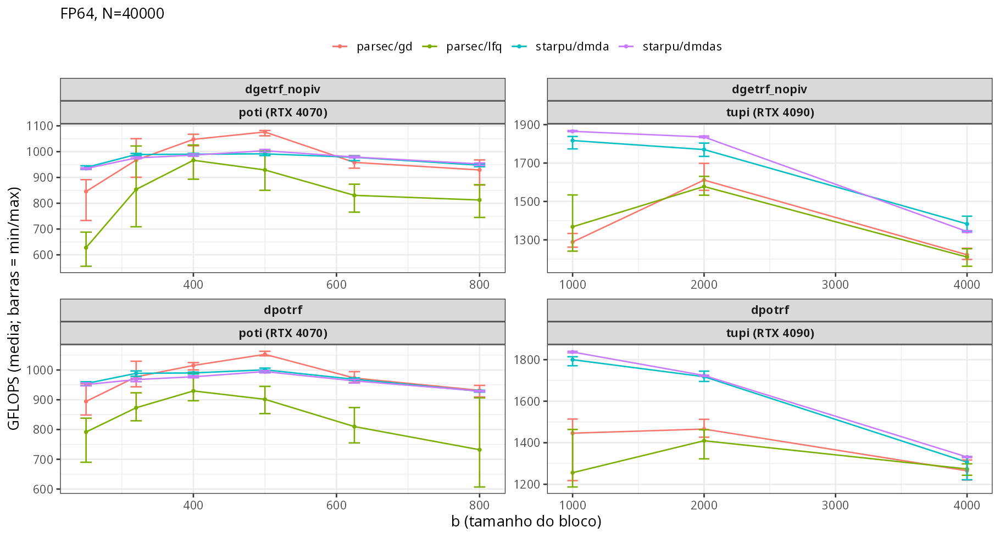
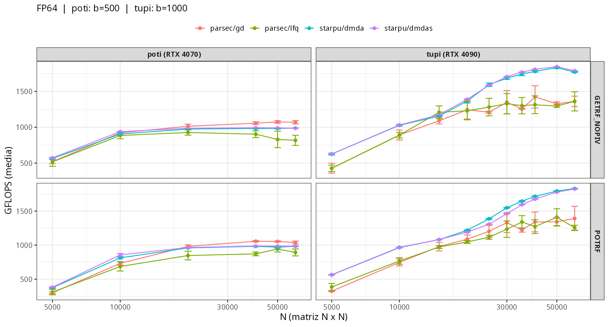
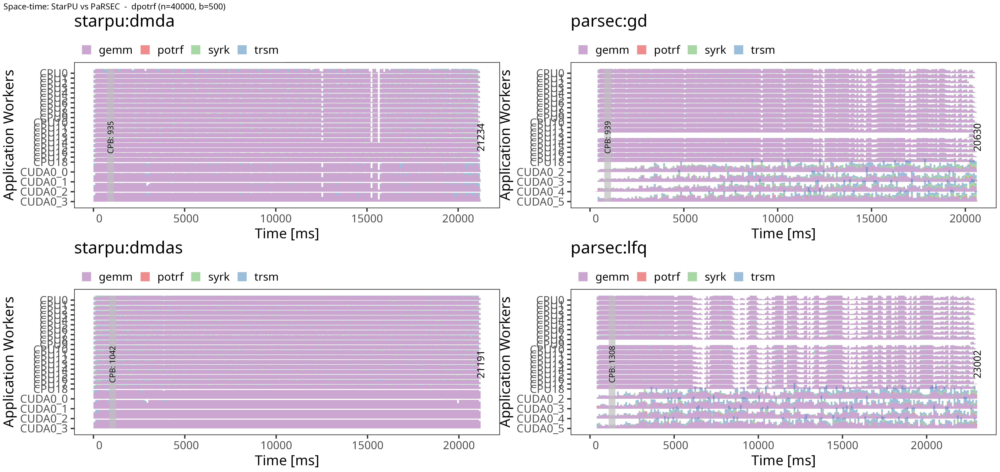
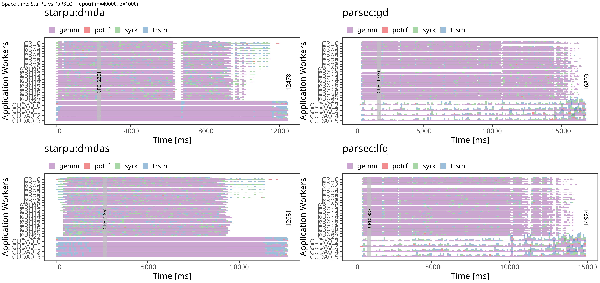
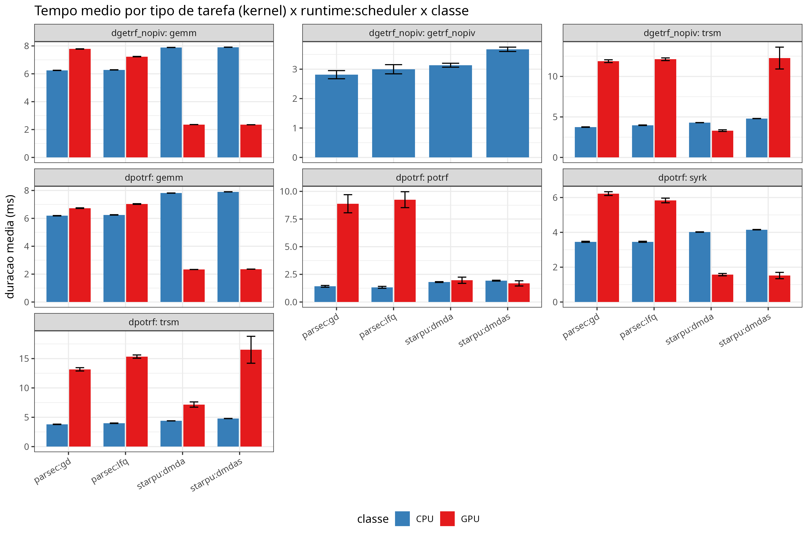
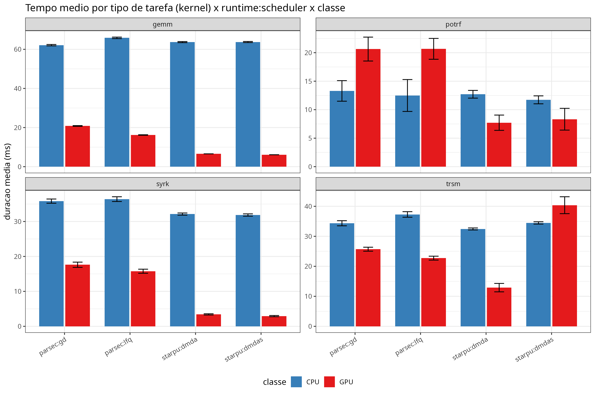
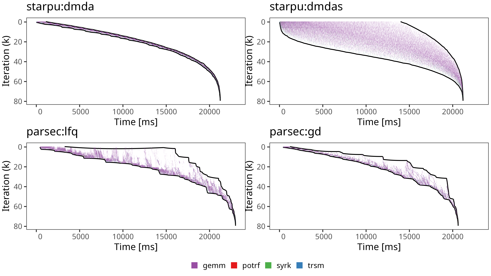
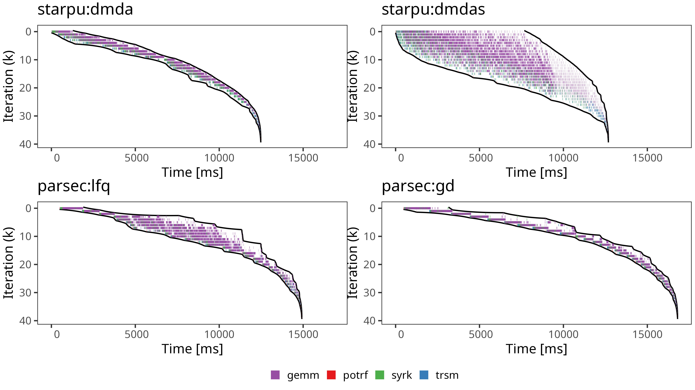
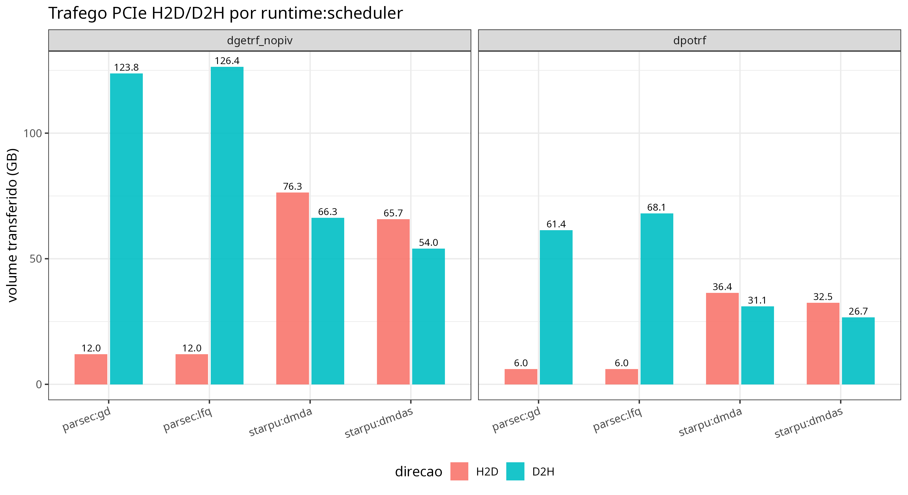
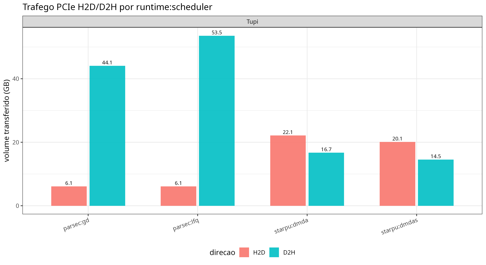

<!-- _class: title-slide -->

## Análise do Impacto de Runtimes Task-Based no Desempenho de Algoritmos de Álgebra Linear Densa

Matheus Augusto Tregnago

Universidade Federal do Rio Grande do Sul — Instituto de Informática

---

# Objetivo

Analisar o impacto de diferentes modelos de execução de runtimes *task-based* no desempenho de algoritmos de álgebra linear densa.

- Comparar **StarPU** e **PaRSEC** usando **Chameleon** como biblioteca unificada
- Avaliar 2 escalonadores de cada runtime
- Execução heterogênea: CPU e GPU
- Analisar GFLOPS, traces, ocupação de recursos e comportamento do escalonamento

---

# Trabalhos relacionados

- **Hoque et al. (2017)**: comparam PTG e DTD no PaRSEC; usam Chameleon com PaRSEC, StarPU e QUARK apenas CPU;
- **Lisito et al. (2025)**: LU com pivotamento parcial sobre StarPU e Chameleon contra PaRSEC e DPLASMA; usam bibliotecas diferentes por runtime
- **Agullo et al. (2015)**: comparam desempenho do StarPU com limites teóricos em plataformas heterogêneas; apenas StarPU

**Gap**: nenhum trabalho compara StarPU vs PaRSEC com a mesma biblioteca em ambiente heterogêneo

---

# StarPU

Runtime *task-based* para plataformas híbridas CPU–GPU
- Desenvolvido da França em 2009
- Múltiplas implementações por tarefa (C, CUDA, OpenCL...)
  - O runtime escolhe dinamicamente onde executar
- DAG construído dinamicamente pela ordem de submissão + modo de acesso
  - Modelo *Sequential Task Flow*: código sequencial, execução paralela

---

# Escalonadores: DMDA e DMDAS

**Deque Model Data Aware**
- Baseado em modelos de desempenho: usa histórico de execuções para estimar o tempo de cada tarefa em cada recurso
- Atribui cada tarefa ao recurso com menor tempo estimado de conclusão, considerando Tempo de computação estimado no recurso alvo e Tempo de transferência de dados necessário 

**DMDA Sorted**
- Variante do DMDA que processa as tarefas em ordem de prioridade
- Prioridades derivadas do caminho crítico do DAG
- Custo extra de ordenação, mas tende a acelerar o caminho crítico

---

# PaRSEC

Runtime *task-based* para arquiteturas distribuídas e heterogêneas 

- Dois paradigmas principais de programação:
  - **PTG**: representação algébrica comprimida do DAG, expandida em tempo de execução
  - **DTD**: inserção dinâmica de tarefas em código de aparência sequencial
- Comunicação entre nós implícita, inferida das dependências

---

# Escalonadores: GD e LFQ

**Global Dequeue**
- Uma única fila dupla global compartilhada por todos os workers
- Balanceamento natural, mas ponto único de contenção; sem localidade e sem *work-stealing*

**Local Flat Queues**
- Cada worker tem uma fila local plana; seleção por prioridade
- Favorece localidade; workers ociosos fazem *work-stealing* dos vizinhos por ordem de distância de hardware

---

# Chameleon

Biblioteca de álgebra linear densa para arquiteturas heterogêneas

- Rotinas para sistemas lineares gerais, simétricos positivos-definidos e mínimos quadrados: fatorações **LU, Cholesky, QR e LQ**
- Baseada nos algoritmos em tiles do PLASMA
- Suporta vários runtimes: StarPU, PaRSEC, QUARK e OpenMP
---

# Dificuldades encontradas

Compatibilidade Chameleon e PaRSEC
- Chameleon fixado a uma versão antiga do PaRSEC;
- **PaRSEC + CUDA indisponível**: a interface **DTD** não suportava corpos CUDA
- Codelets do Chameleon para PaRSEC eram limitados a CPU

**Ferramentas de análise**
- StarVZ não suporta o formato de trace do PaRSEC
- Coleta do **DAG** do PaRSEC não era nativa no fluxo de captura

---

# Soluções adotadas

- **PaRSEC  + CUDA**: implementado suporte a CUDA na interface **DTD** e adicionados os *codelets* GPU no Chameleon com **cuBLAS/cuSOLVER**
- **Análise de traces**: scripts que reconstroem as tabelas do **StarVZ** a partir do trace nativo e do DAG do PaRSEC

---

# Design Experimental: Fatorial Completo
**Fatores**:
- Escalonador (`dmda`, `dmdas`, `lfq`, `gd`)
- Tamanho do problema `N` (5000 a 60000)
- Algoritmo (Cholesky, LU)

**Escolha do tamanho do bloco**:
- Varredura de `b` para achar o bloco ideal

---

# Ambiente de execução
- Experimentos no cluster **PCAD**

| | poti | tupi |
|---|---|---|
| CPU | Intel Core i7-14700KF | Intel Core i9-14900KF |
| RAM | 96 GB DDR5 | 128 GB DDR5 |
| GPU | RTX 4070, 12 GB | RTX 4090, 24 GB |
| Storage | 119 GB NVMe + 1.7 TB SSD | 1.8 TB NVMe + 1.7 TB SSD |

---

# Escolha do tamanho do bloco

---

# Desempenho dos Runtimes

---

# Traces Cholesky - Poti

---

# Traces Cholesky - Tupi

---

# Tempos de cada tarefa Cholesky - Poti

---

# Tempos de cada tarefa Cholesky - Tupi

---

# K-Iteration Cholesky Poti

---

# K-Iteration Cholesky Tupi

---

# Transferência de dados Cholesky

 

---

# Conclusões

- **Poti**: PaRSEC se saiu melhor, porque ele usou menos a GPU, que rende menos que as 19 CPUs
- **Tupi**: a GPU é majoritária então o StarPU se saiu melhor, pois faz mais uso dela 
- **Custo estrutural do StarPU**: threads dos workers CUDA disputam os cores da CPU
- **Transferências**: PaRSEC devolve todo tile escrito
- PaRSEC escolhe o device sem modelo de desempenho

---

# Trabalhos futuros

- Estender a comparação para algoritmos e escalonadores adicionais
- Avaliar o impacto sob Single Precision
- Analisar o desempenho a partir de uma aplicação real que tenha o Chameleon como dependência 

---

# Referências

1. Augonnet, C. et al. "StarPU: A Unified Platform for Task Scheduling on Heterogeneous Multicore Architectures." *Euro-Par 2009*.

2. Bosilca, G. et al. "PaRSEC: Exploiting Heterogeneity to Enhance Scalability." *Computing in Science & Engineering*, 2013.

3. Agullo, E. et al. "Chameleon: A Dense Linear Algebra Software for Heterogeneous Architectures." Inria, 2012.

4. Pei, Y., Bosilca, G., Dongarra, J. "Sequential Task Flow Runtime Model: Improvements and Limitations."

5. Thibault, S. "On Runtime Systems for Task-Based Programming on Heterogeneous Platforms." Inria.

6. Hoque, R., Hérault, T., Bosilca, G., Dongarra, J. "Dynamic Task Discovery in PaRSEC: A Data-flow Task-based Runtime." *ScalA 2017*.

7. Pinto, V. G. et al. "Performance Evaluation of Dense Linear Algebra Kernels using Chameleon and StarPU on AWS." *SBAC-PAD*, 2024.

8. Agullo, E. et al. "Bridging the Gap between Performance and Bounds of Cholesky Factorization on Heterogeneous Platforms." *IPDPS Workshops*, 2015.

9. Lisito, A. et al. "Scalable and Portable LU Factorization with Partial Pivoting on Top of Runtime Systems." *IEEE International Parallel and Distributed Processing Symposium (IPDPS)*, 2025.

