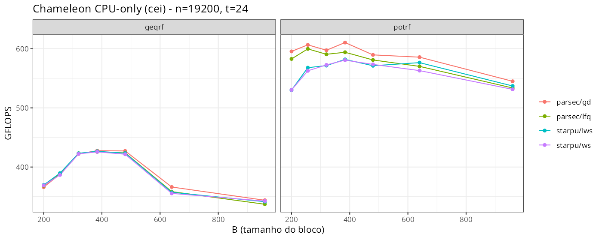
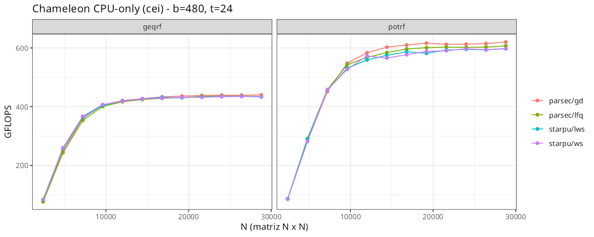
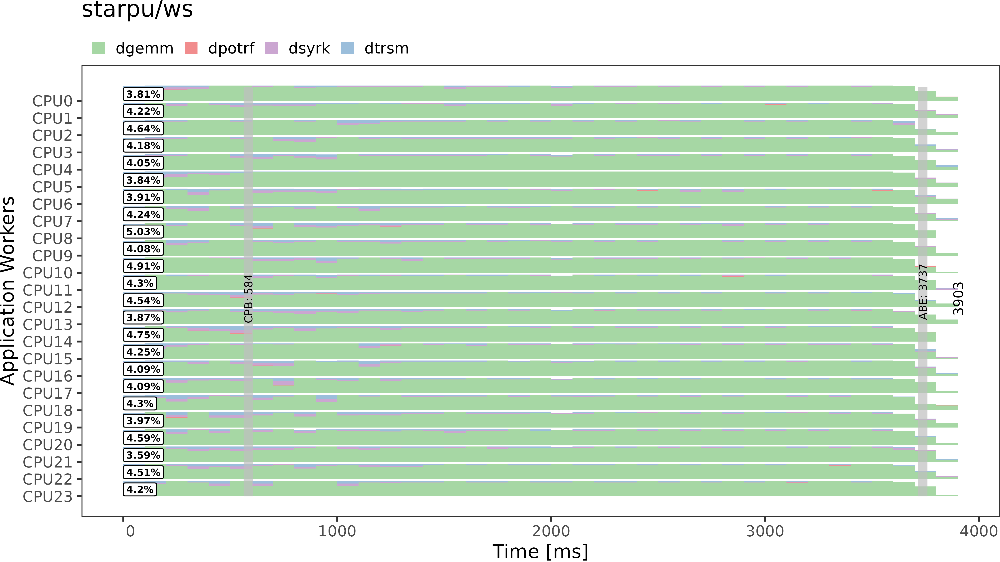
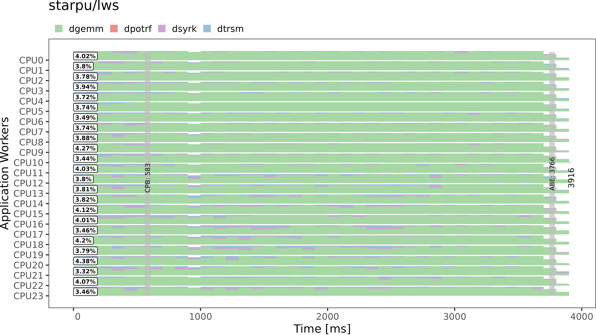
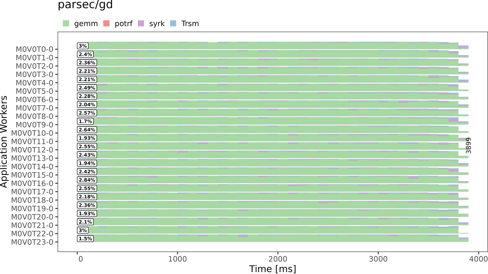
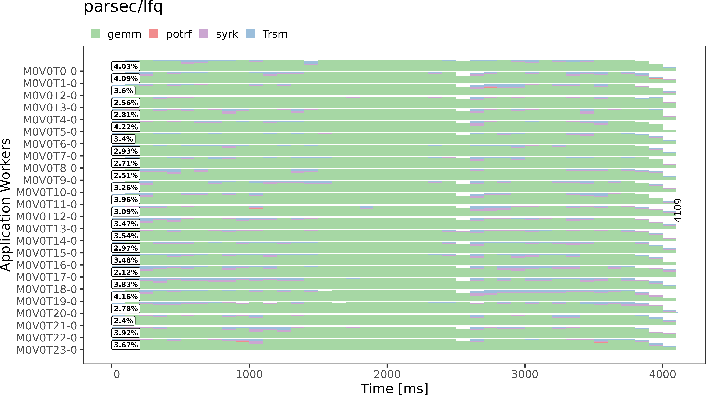

<!-- _class: title-slide -->

## Análise do Impacto de Runtimes Task-Based no Desempenho de Algoritmos de Álgebra Linear Densa

Matheus Augusto Tregnago

Universidade Federal do Rio Grande do Sul — Instituto de Informática

---

# Recapitulação do objetivo

Este trabalho tem como objetivo analisar o impacto de diferentes **modelos de execução** de runtimes *task-based* no desempenho de algoritmos de álgebra linear densa.

- Comparar **StarPU** vs **PaRSEC** usando Chameleon como framework unificado
- Identificar cenários em que cada runtime é mais vantajoso utilizando a biblioteca **Chameleon**

---

# Dificuldades encontradas
- Compatibilidade entre **Chameleon** e **PaRSEC**:
  - **Chameleon** não tinha suporte para compilação com **PaRSEC** no modo `profiling`
  - Foi criada uma *issue* e após 3 semanas o problema foi corrigido
- Falta de documentação no **PaRSEC**:
  - Variáveis de ambiente sem documentação
  - Busca no código fonte para descobrir 
- Configuração do ambiente de execução

---

# StarVZ
- Biblioteca em R para análise de performance de aplicações *task-based* que utilizam o runtime **StarPU**
- Executa em duas etapas: 
  1. Pré-processamento dos dados
  2. Visualização dos dados
- Possui suporte a leitura de traces no formato `.paje`
- Não possui suporte nativo aos traces do **PaRSEC**
- Solução: Ajustar a fase 1 para suportar o trace do **PaRSEC**

---

# Reprodutibilidade
- Toda a pilha de software foi portada para o gerenciador de pacotes `nix`
- Os scripts de experimentação e análise estão disponíveis no **GitHub**
- Contém documentação detalhada de como rodar os experimentos
- Flake com 3 shells:
  - Chameleon compilado com **StarPU**
  - Chameleon compilado com **PaRSEC**
  - Ambiente de desenvolvimento e análise dos resultados

---

# Design Experimental: Fatorial Completo
**Fatores**:
- Runtime e escalonador
- Tamanho do problema
- Algoritmo (Cholesky, QR)

**Parâmetros fixos**: tamanho do bloco = 480, 10 replicações

**Etapa preliminar — escolha do tamanho do bloco**:
- Fator: tamanho do bloco
- Tamanho do problema fixo em 19200

---

# Ambiente de execução
- Os primeiros experimentos foram executados na partição `cei` do **PCAD**

| Componente | Especificação |
|---|---|
| Processadores | 2 × Intel Xeon Silver 4116 |
| Frequência | 2.1 GHz |
| Núcleos | 24 cores |
| Threads | 48 threads |
| Memória RAM | 96 GB DDR4 |
| Armazenamento | 21.8 TB HDD + 894.3 GB SSD |
| Placa-mãe | Supermicro X11DPU |

- **Motivo**: Alta disponibilidade de uso

---

# Escolha do tamanho do bloco

---

# Desempenho dos Runtimes 

---

# Trace: StarPU WS

---
# Trace: StarPU LWS

---
# Trace: PaRSEC GD

---
# Trace: PaRSEC LFQ

---

# Conclusões preliminares
- Na fatoração Cholesky o `GD` do **PaRSEC** se saiu melhor
  - Apresentou maior GFLOPS na maioria das execuções
  - Menor tempo em *idle*
- Os escalonadores não apresentaram diferenças significativas na fatoração QR

---

# Próximos passos
- Coletar mais métricas do **PaRSEC** dentro das informações disponibilizadas pelo seu trace
- Avaliar novos algoritmos e escalonadores de ambos runtimes
- Executar em GPU
- Testar a partir de uma aplicação real que utiliza o **Chameleon** como dependência

---

# Referências

1. Augonnet, C. et al. "StarPU: A Unified Platform for Task Scheduling on Heterogeneous Multicore Architectures." *Euro-Par 2009*.
2. Bosilca, G. et al. "PaRSEC: Exploiting Heterogeneity to Enhance Scalability." *Computing in Science & Engineering*, 2013.
3. Agullo, E. et al. "Chameleon: A dense linear algebra software for heterogeneous architectures." Inria.
4. Pei, Y., Bosilca, G., Dongarra, J. "Sequential Task Flow Runtime Model: Improvements and Limitations."
5. Bosilca, G. et al. "PaRSEC: A programming paradigm exploiting heterogeneity for enhancing scalability." *SC25*.
6. Thibault, S. "On Runtime Systems for Task-based Programming on
Heterogeneous Platforms." Inria.
