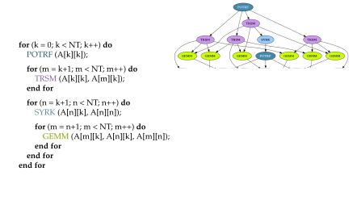
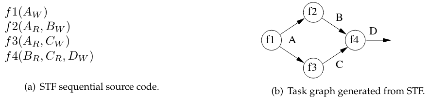
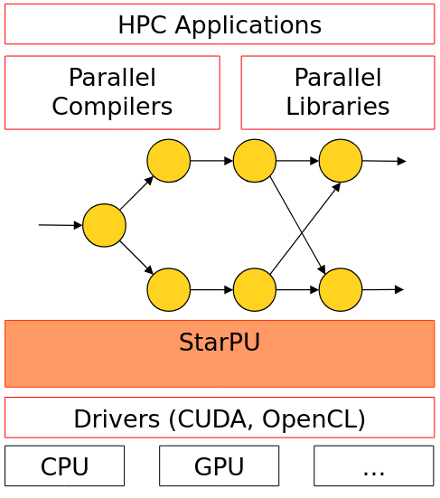
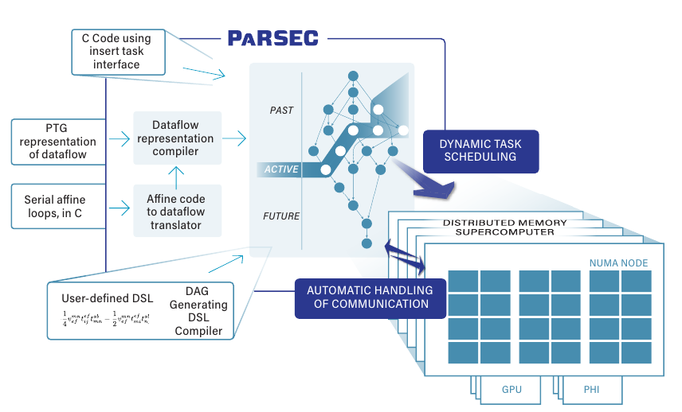
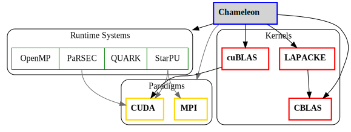
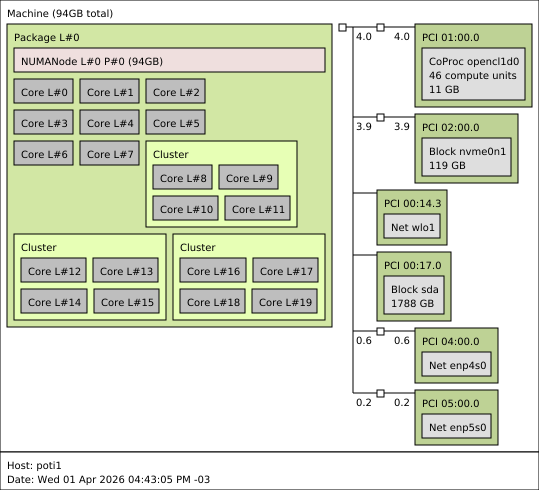
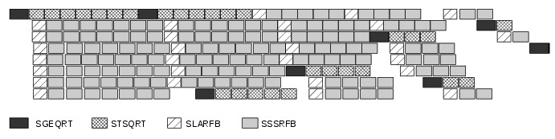

<!-- _class: title-slide -->

## Análise do Impacto de Runtimes Task-Based no Desempenho de Algoritmos de Álgebra Linear Densa

Matheus Augusto Tregnago

Universidade Federal do Rio Grande do Sul — Instituto de Informática

---

# Introdução

- Bibliotecas modernas de álgebra linear de alto desempenho utilizam modelos baseados em tarefas para explorar paralelismo em arquiteturas multicore e heterogêneas

- O desempenho não depende apenas do algoritmo numérico, mas também do **runtime** responsável pelo escalonamento das tarefas e pela movimentação de dados

- A biblioteca **Chameleon** permite trocar o runtime sem alterar o algoritmo

---

# Objetivo

Este trabalho tem como objetivo analisar o impacto de diferentes **modelos de execução** de runtimes task-based no desempenho de algoritmos de álgebra linear densa.

- Comparar **StarPU** vs **PaRSEC** usando Chameleon como framework unificado
- Identificar cenários em que cada runtime é mais vantajoso

---

# Task-Based Programming

- O algoritmo é decomposto em **tarefas** com dependências de dados explícitas
- As tarefas formam um grafo (DAG) que o runtime escalona dinamicamente

---

# Sequential Task Flow (STF)

- Modelo predominante de interação com runtimes task-based
- Uma thread principal insere as tarefas na ordem sequencial do algoritmo
- O runtime descobre automaticamente as dependências a partir do modo de acesso aos dados

---

# StarPU

- Runtime task-based desenvolvido pelo **Inria** (França)
- Suporte nativo a **CPU + GPU** e **MPI**
- Transferências de dados automáticas entre memórias (host e device)

---

# PaRSEC

- Runtime task-based desenvolvido pela University of Tennessee
- Escalabilidade para sistemas distribuídos de larga escala

---

# Chameleon

- Biblioteca de **álgebra linear densa** para arquiteturas heterogêneas
- Baseada no PLASMA, estendida para **GPUs** e **memória distribuída**
- Interface genérica com múltiplos runtimes: **StarPU**, **PaRSEC**, QUARK, OpenMP

---

# Metodologia de experimentação

**Algoritmos selecionados:**
- `potrf` Fatoração Cholesky
- `geqrf` Fatoração QR

**Escalonadores selecionados:**

| Runtime | Escalonador |
|---------|-------------|
| StarPU  | `lws`       |
| StarPU  | `dmda`      |
| PaRSEC  | `LFQ`     |
| PaRSEC  |  `PBQ` |

---

# Ambiente Experimental — PCAD/UFRGS

**PCAD – Parque Computacional de Alto Desempenho**

Mantido pelo LPPD (Laboratório de Processamento Paralelo e Distribuído), vinculado ao Instituto de Informática da UFRGS.

- Mais de **1.000 núcleos de CPU** e **100.000 CUDA threads**
- Mais de **40 nós computacionais** com configurações heterogêneas
- Gerenciador de filas **Slurm** para submissão de jobs
- Acesso remoto via **SSH**: `gppd-hpc.inf.ufrgs.br`

---

# Máquina Selecionada — poti

- **Processador**: Intel Core i7-14700KF, 3.4 GHz, 20 cores, 28 threads 
- **Memória RAM**: 96 GB DDR5 
- **GPU**: NVIDIA GeForce RTX 4070 (12 GB) 
- **Armazenamento**: 119.2 GB NVMe + 1.7 TB SSD 
- **Placa-Mãe**: Gigabyte Z790 UD AX 

---

# Métricas de Análise

- Tempo total de execução
- Desempenho (GFLOPS)
- Utilização de CPU/GPU

---

# Referências

1. Augonnet, C. et al. "StarPU: A Unified Platform for Task Scheduling on Heterogeneous Multicore Architectures." *Euro-Par 2009*.
2. Bosilca, G. et al. "PaRSEC: Exploiting Heterogeneity to Enhance Scalability." *Computing in Science & Engineering*, 2013.
3. Agullo, E. et al. "Chameleon: A dense linear algebra software for heterogeneous architectures." Inria.
4. Pei, Y., Bosilca, G., Dongarra, J. "Sequential Task Flow Runtime Model: Improvements and Limitations."
5. Bosilca, G. et al. "PaRSEC: A programming paradigm exploiting heterogeneity for enhancing scalability." *SC25*.
6. Thibault, S. "On Runtime Systems for Task-based Programming on
Heterogeneous Platforms." Inria.
